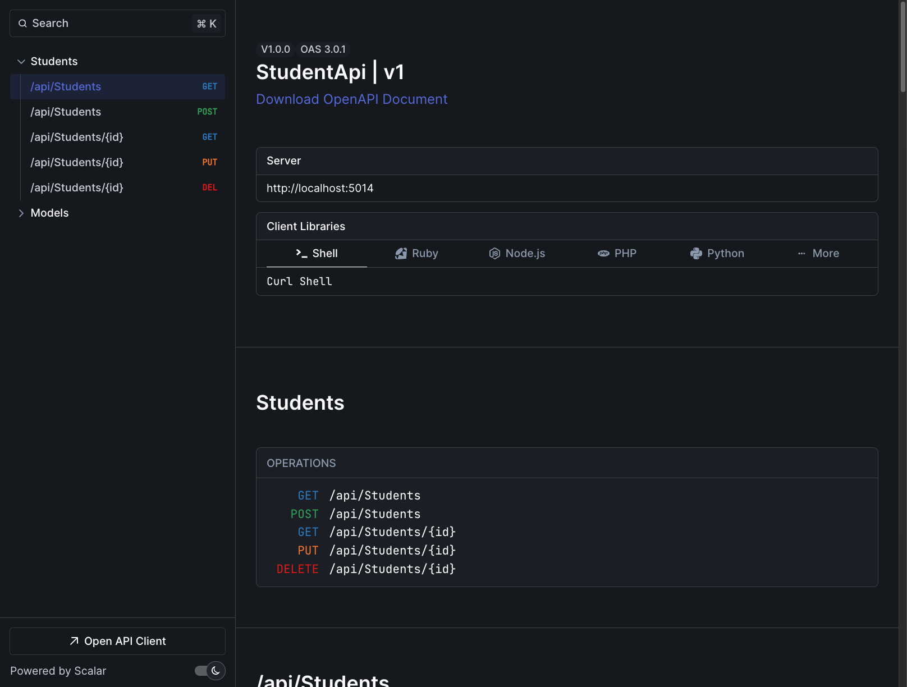

# Scalar API Documentation Guide

## Overview
This project uses Scalar (formerly Swagger UI) for API documentation. Scalar provides an interactive interface for exploring and testing the API endpoints.

## Setup

1. **NuGet Package Installation**
```bash
dotnet add package Scalar.AspNetCore --version 2.0.29
```

2. **Program.cs Configuration**
```csharp
var builder = WebApplication.CreateBuilder(args);

// Add Scalar services
builder.Services.AddOpenApi();

var app = builder.Build();

if (app.Environment.IsDevelopment())
{
    // Map Scalar endpoints
    app.MapOpenApi();
    app.MapScalarApiReference();
}
```

## Accessing Scalar UI

- Development Environment URL: `https://localhost:7014/scalar`
- Alternative URL: `http://localhost:5014/scalar`

## Available Endpoints Documentation

### 1. Get All Students
```yaml
GET /api/students
Parameters:
  - page (query, optional): Page number (default: 1)
  - pageSize (query, optional): Items per page (default: 10)
Response: PaginatedList<Student>
```

### 2. Get Student by ID
```yaml
GET /api/students/{id}
Parameters:
  - id (path, required): Student ID
Response: Student
```

### 3. Create Student
```yaml
POST /api/students
Request Body: Student
Content-Type: application/json
Example:
{
    "name": "سارة الخالدي",
    "birthDate": "2001-06-15T00:00:00",
    "phone": "+966512345678",
    "gender": "Female"
}
```

### 4. Update Student
```yaml
PUT /api/students/{id}
Parameters:
  - id (path, required): Student ID
Request Body: Student
Content-Type: application/json
```

### 5. Delete Student
```yaml
DELETE /api/students/{id}
Parameters:
  - id (path, required): Student ID
```

## Model Schemas

### Student
```yaml
properties:
  id:
    type: integer
    format: int32
  name:
    type: string
    required: true
  birthDate:
    type: string
    format: date-time
  phone:
    type: string
    required: true
  gender:
    type: string
    enum: [Male, Female]
```

### PaginatedList<Student>
```yaml
properties:
  totalCount:
    type: integer
    format: int32
  totalPages:
    type: integer
    format: int32
  currentPage:
    type: integer
    format: int32
  pageSize:
    type: integer
    format: int32
  data:
    type: array
    items:
      $ref: '#/components/schemas/Student'
```

## Testing with Scalar UI

1. **Authentication** (if implemented)
   - Click "Authorize" button
   - Enter credentials
   - Click "Authorize"

2. **Making Requests**
   - Select an endpoint
   - Click "Try it out"
   - Fill in parameters
   - Click "Execute"

3. **Viewing Responses**
   - Response Status
   - Response Headers
   - Response Body
   - Curl Command

## Best Practices

1. **XML Comments**
Add XML comments to controllers and models for better documentation:

```csharp
/// <summary>
/// Gets a student by their ID
/// </summary>
/// <param name="id">The student's unique identifier</param>
/// <returns>The student details</returns>
/// <response code="200">Returns the student</response>
/// <response code="404">If student is not found</response>
[HttpGet("{id}")]
[ProducesResponseType(typeof(Student), StatusCodes.Status200OK)]
[ProducesResponseType(StatusCodes.Status404NotFound)]
public async Task<ActionResult<Student>> GetById(int id)
```

2. **Response Types**
Always specify response types for better documentation:

```csharp
[ProducesResponseType(typeof(PaginatedList<Student>), StatusCodes.Status200OK)]
[ProducesResponseType(StatusCodes.Status400BadRequest)]
```

3. **Operation IDs**
Use meaningful operation IDs:

```csharp
[HttpGet(Name = "GetStudentById")]
```

## Customization

### 1. Scalar UI Configuration
```csharp
builder.Services.AddOpenApi(options =>
{
    options.Title = "Student API";
    options.Version = "v1";
    options.Description = "API for managing student records";
    options.Contact = new()
    {
        Name = "API Support",
        Email = "support@example.com"
    };
});
```

### 2. Security Definitions
```csharp
options.AddSecurityDefinition("Bearer", new()
{
    Type = SecuritySchemeType.Http,
    Scheme = "bearer",
    BearerFormat = "JWT"
});
```

## Notes
- Scalar UI is only available in development environment
- All endpoints support JSON format
- Date format follows ISO 8601 standard
- Arabic text is fully supported in request/response
